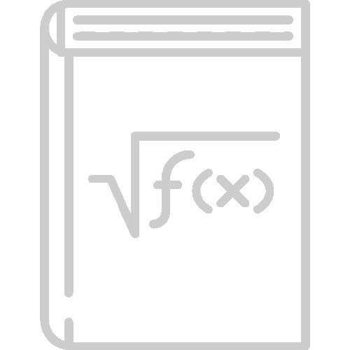

# Calculator Commands

We've discussed numbers, both fractional and decimal as well as operands that perform basic mathematical functions.  This chapter starts discussing commands which are the heart and soul of RPNCalc.

In Calculator commands, these are the basic commands that operations on the numbers on the stack.  Most are fairly simple and intutitive, but there are a few that are a bit odd.  I'm looking at you `dice`.

These commands, like the others you'll read about later, are executed by typing the command name, and any needed arguments into RPNCalc.  Often there are several different names and abreviations for the same command.  This is just to make it easier to remember.  

|Command|Description|
|-------|-----------|
|u [#]  undo [#]| **UNDO:** By default, undo the last operation.  However, if an undo stack line number is given, as displayed in the `list undo` command, undo will restore the stack back to that step.  Please keep in mind that if you restore back to a previous undo state, later undo states will be discarded.  Typically, however, `u` undo is used to undo the previous step|
|f   flip | **FLIP SIGN:** Flip the sign on the top stack item / line1|
|c   clear| **CLEAR:** Clear the screen, and empty the current stack.  Memory data is retained and you can undo the clear with the `u` undo command|
|cl   clean| **CLEAN SCREEN:** Clear the current screen, but keep the stack.  After cleaning, the stack will be displayed at the top of the screen|
|d [#]   del [#]   drop [#]| **DELETE:** Delete the top stack item (line 1) or, optionally, delete the line number provided with `d <linenumber>` command|
|s [#] \[#]   swap [#] \[#]| **SWAP LINES:** Swap the position of the top two stack items (line 1 & 2) with `s`.  You can swap any two line numbers in your stack by providing the two line numbers `s # #`|
|%| **PERCENT:** Assumes line1 contains a percent.  This converts that into a number by simply dividing that value by 100.  For example, if you want to take 50.123% of a number, you could just enter in `50.123 [ENTER] % [ENTER] *`|
|sqrt| **SQUARE ROOT:** Perform a [square root](https://en.wikipedia.org/wiki/Square_root) of the top stack item / line1|
|round [n]| **ROUND:** Round the top stack item to [n] decimal places.  If [n] is not given, round to the nearest integer (zero decimal places).  Example1: `3.14159` `round` would round to `3`.  Example2: `3.14159` `round 4` would round to `3.1416`|
|aa [keep]| **ADD ALL:** Add all stack items together and return the result to the stack.  If the optional `keep` parameter is sent, the elements added will be retained on the stack and the total will be added to the top of the stack.  The entire `keep` command is not necessary, anything that starts with `k` will work|
|mod| **MODULUS:** [Modulus](en.wikipedia.org/wiki/Modular_arithmetic) is the remainder after a division.  This command will perform a division of the top two stack items and return the remainder only back to the stack|
|avg [keep]|**AVERAGE:** Calculate the average of the numbers on the stack.  The stack will be replaced with the average value.  If `keep` is provided, the stack will be retained and the average will be added on top. `average` or `mean` can also be used|
|sd [keep]|**STANDARD DEVIATION:** Calculate the [standard deviation](https://en.wikipedia.org/wiki/Standard_deviation) of the items in the stack.  The stack items will be replaced by the result. If `keep` is provided, the the standard deviation will simple be added to the top of the stack in line1|
|copy [#]   dup [#]|**COPY:** With no number provided, copy will duplicate the top stack item / line1 and place it on the stack.  If the optional line number is given, the value at the line will be duplicated to the top of the stack|
|log|**LOGARITHM BASE e:** Calculates the [natural logarithm (base e)](https://en.wikipedia.org/wiki/Natural_logarithm)|
|log10|**LOGARITHM BASE 10:** Calculates the [base10 logarithm](https://en.wikipedia.org/wiki/Common_logarithm)|
|int| **INTEGER:** Converts the top stack item (line 1) to it's integer value.  This will discard the decimal portion regardless of it's value.  For example: `4.34` will result in `4`.  `4.999` will also result in `4`. If rounding is desired, execute the `round` command prior to `int`|
|abs| **ABSOLUTE VALUE:** Takes the [absolute value](https://en.wikipedia.org/wiki/Absolute_value#:~:text=In%20mathematics%2C%20the%20absolute%20value,and%20%7C0%7C%20%3D%200) of line 1.  The returns the positive value of the number|
|Min|**MINIMUM VALUE:** Add the smallest value in the stack to the top of the stack|
|Max|**MAXIMUM VALUE:** Add the largest value in the stack to the top of the stack|
|rand [low] \[high] | **RANDOM NUMBER GENERATION:** Generate a random integer number between the provided [l]ow and [h]igh numbers inclusive to both.  If no numbers are provided, then the random number will be between 1 and 100 inclusive|
|dice XdY| **DICE ROLL:** Roll a Y sided die X times and add the results to the stack.  Default is 1d6. While not a normal calculator function, I find it fun|
