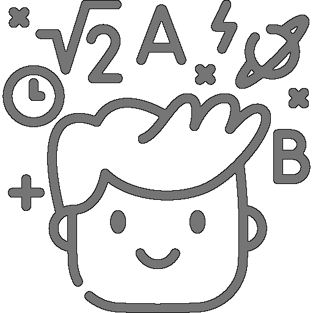

## Calculator Commands

We've discussed numbers, fractional, scientific notation, and decimal, as well as operands that perform basic mathematical functions. This chapter starts discussing commands
which are the heart of RPNCalc.

Calculator Commands are the basic commands that operations on the numbers you've placed on the stack. Most are fairly simple and intuitive, but there are a few that are a bit
odd. I'm looking at you `dice`.

These commands, like the others you'll read about later, are executed by typing the command name, and any needed arguments into RPNCalc. Often there are several different
names and abbreviations for the same command. This is just to make it easier to remember. Brackets, `[]` around an option denotes it is optional.

## Commands Table

| 
Command
 | Description                                                                                                                                                                                                                                                                                                                                                                                                                                                                                                                                                                                                                                                                                                                                                                                                                                                                                                                                                                                                                                                                                            |
|----------------------------------------|--------------------------------------------------------------------------------------------------------------------------------------------------------------------------------------------------------------------------------------------------------------------------------------------------------------------------------------------------------------------------------------------------------------------------------------------------------------------------------------------------------------------------------------------------------------------------------------------------------------------------------------------------------------------------------------------------------------------------------------------------------------------------------------------------------------------------------------------------------------------------------------------------------------------------------------------------------------------------------------------------------------------------------------------------------------------------------------------------------|
| aa [keep] addall [keep]             | **ADD ALL** Add all stack items together and replace the numbers on the stack with the result.  If the optional `keep` parameter is sent, the elements added will be retained on the stack and the total will be added to the top of the stack.  The entire `keep` command is not necessary, anything that starts with `k` will work                                                                                                                                                                                                                                                                                                                                                                                                                                                                                                                                                                                                                                                                                                                                                                |
| abs                                    | **ABSOLUTE VALUE** Takes the [absolute value](https://en.wikipedia.org/wiki/Absolute_value#:~:text=In%20mathematics%2C%20the%20absolute%20value,and%20%7C0%7C%20%3D%200) of line 1.  The returns the positive value of the number.  Not the most useful command on it's own as you can always `f` flip the sign.  However it could be useful as part of a User Defined Function                                                                                                                                                                                                                                                                                                                                                                                                                                                                                                                                                                                                                                                                                                                     |
| avg [keep] mean [keep]              | **AVERAGE / MEAN** Calculate the [average](https://en.wikipedia.org/wiki/Average) of all of the numbers on the stack.  The stack will be replaced with the result.  If `keep` is provided, the stack will be retained and the average will be added on top. `average` or `mean` can also be used                                                                                                                                                                                                                                                                                                                                                                                                                                                                                                                                                                                                                                                                                                                                                                                                    |
| c   clear                           | **CLEAR** Clear the current stack and the screen.  Memory data is retained and you can undo the clear with the undo `u` command                                                                                                                                                                                                                                                                                                                                                                                                                                                                                                                                                                                                                                                                                                                                                                                                                                                                                                                                                                     |
| cl   clean                          | **CLEAN SCREEN** Clear the current screen, but keep the stack.  After cleaning, the stack will be displayed at the top of the screen.  Used to remove the clutter                                                                                                                                                                                                                                                                                                                                                                                                                                                                                                                                                                                                                                                                                                                                                                                                                                                                                                                                   |
| copy [#]   dup [#]                  | **COPY** With no number provided, copy will duplicate the top stack item / `line1` and place it on the stack.  If the optional line number is given, the value at that line will be duplicated to the top of the stack. A negative number may also be provided which will be a relative reference.  For example, if `-1` is provided, the `line2` value will be copied.  This is very useful when the command is used during the creation of a User Defined Function and the amount of numbers on the stack is unknown                                                                                                                                                                                                                                                                                                                                                                                                                                                                                                                                                                              |
| d d [#] d [#-#] del delete | **DELETE** If `d` is given without any parameters, it will delete `line1`.  If a line number is given after the `d`, that line number will be deleted.  A range can be given as well, such as `d 1-3` and RPNCalc will delete those lines and everything in between.  A negative number can also be provided which is a relative reference.  `-1` will delete the value one behind the current top of the stack value. Very useful for user defined functions where the stack may be unknown. `del` and `delete` may also be used                                                                                                                                                                                                                                                                                                                                                                                                                                                                                                                                                                   |
| down                                   | **DOWN** Rotates the stack down on the screen. The top of the stack item (`line1`) will go to the end of the stack and everything else will shift down. This is the reverse of `up`                                                                                                                                                                                                                                                                                                                                                                                                                                                                                                                                                                                                                                                                                                                                                                                                                                                                                                                 |
| dice XdY roll XdY                   | **DICE ROLL** Roll a Y sided die X times and add the results to the stack.  Default is 1d6 which roll a six sided dice one time. This is a more specific version of `random`. While not a normal calculator function, it's fun! (Especially if you're an old school gamer). The random value is generated with Java's SecureRandom and should be secure                                                                                                                                                                                                                                                                                                                                                                                                                                                                                                                                                                                                                                                                                                                                             |
| echo MESSAGE                           | **ECHO** Simply display the provided message prior to showing the stack. This was created to assist with use with User Defined Functions.  There is limited usefulness for normal calculator operations                                                                                                                                                                                                                                                                                                                                                                                                                                                                                                                                                                                                                                                                                                                                                                                                                                                                                             |
| fact  factorial                     | **FACTORIAL** Takes the factorial of `line1`. The factorial target number must be an integer, so if there is a decimal component, it will be dropped (not rounded) as with the `int` command                                                                                                                                                                                                                                                                                                                                                                                                                                                                                                                                                                                                                                                                                                                                                                                                                                                                                                        |
| f   flip                            | **FLIP SIGN** Flip the sign on the top stack item (`line1`). This is effectively multiplying `line1` by `-1`                                                                                                                                                                                                                                                                                                                                                                                                                                                                                                                                                                                                                                                                                                                                                                                                                                                                                                                                                                                        |
| int                                    | **INTEGER** Converts the top stack item (`line1`) to it's integer value.  This will discard the decimal portion regardless of it's value.  For example: `4.34` will result in `4` and `4.999` will also result in `4`. If rounding is desired, execute the `round` command prior to `int` (or create a user defined function)                                                                                                                                                                                                                                                                                                                                                                                                                                                                                                                                                                                                                                                                                                                                                                       |
| lr [add] lr [x]                     | **SIMPLE LINEAR REGRESSION** [Linear regression](https://www.graphpad.com/guides/the-ultimate-guide-to-linear-regression) is used to model the relationship between two variables and create a line that can be used to estimate other values using a line-of-best-fit method. This implementation is for simple linear regression, and will display the formula, slope, y-intercept as well as add the next expected value to the top of the stack.  If `add` (or just `a`) is entered, the next predicted value will be added to the top of the stack (`line1`). If a number is provided (`x`), the predicted `y` value will be displayed.  The `y` value is the result of the linear extrapolation at the `x` value. If both are added, the y value at the x location will be both calculated and added to the top of the stack (`line1`)  The values will be plotted from the bottom of the stack to the top (`line1`)(which is probably want you want).  If you need it the other way around, simply reverse the stack with the `reverse` or `rev` command prior to executing `lr` |
| log                                    | **LOGARITHM BASE e** Calculates the [natural logarithm (base e)](https://en.wikipedia.org/wiki/Natural_logarithm). Please note that these are calculated as a `double` and therefore do not have unlimited precision                                                                                                                                                                                                                                                                                                                                                                                                                                                                                                                                                                                                                                                                                                                                                                                                                                                                                |
| log10                                  | **LOGARITHM BASE 10** Calculates the [base10 logarithm](https://en.wikipedia.org/wiki/Common_logarithm). Please note that these are calculated as a `double` and therefore do not have unlimited precision                                                                                                                                                                                                                                                                                                                                                                                                                                                                                                                                                                                                                                                                                                                                                                                                                                                                                          |
| max                                    | **MAXIMUM VALUE** Copies the largest value in the top of the stack (`line1`)                                                                                                                                                                                                                                                                                                                                                                                                                                                                                                                                                                                                                                                                                                                                                                                                                                                                                                                                                                                                                        |
| median [keep]                          | **MEDIAN** Replaces the current stack with the [median](https://en.wikipedia.org/wiki/Median) value. For an odd number of stack items, the "middle" value will be used.  With an even number of items there is no "middle" value so the two center most values will be averaged. If the `keep` flag is used, the median value will be added on top of the stack retaining the current stack values                                                                                                                                                                                                                                                                                                                                                                                                                                                                                                                                                                                                                                                                                                  |
| min                                    | **MINIMUM VALUE** Copies the smallest value of the stack items to the top of the stack (`line1`)                                                                                                                                                                                                                                                                                                                                                                                                                                                                                                                                                                                                                                                                                                                                                                                                                                                                                                                                                                                                    |
| mod modulus                         | **MODULUS / REMAINDER** [Modulus](https://en.wikipedia.org/wiki/Modular_arithmetic) is the remainder after a division.  This command will perform a division of the top two stack items (removing them from the stack) and return the remainder back to the stack.  Please note that RPNCalc now uses the BigDecimal [Remainder method](https://docs.oracle.com/javase/8/docs/api/java/math/BigDecimal.html#:~:text=1.5-,remainder,-public%C2%A0BigDecimal%C2%A0remainder(BigDecimal%C2%A0divisor)). This makes the point that remainder is different than modulus. The remainder is given by `subtract(this.divideToIntegralValue(divisor).multiply(divisor))` Note that this is not the modulo operation as the result can be negative                                                                                                                                                                                                                                                                                                                                                         |
| rand [low] \[high]                     | **RANDOM NUMBER GENERATION** Generate a random integer number between the provided `[l]ow` and `[h]igh` numbers inclusive to both.  If no numbers are provided, then the random number will be between 1 and 100 inclusive. The random value is generated with Java's SecureRandom and should be secure                                                                                                                                                                                                                                                                                                                                                                                                                                                                                                                                                                                                                                                                                                                                                                                             |
| repeat [num] rep [num]              | **REPEAT** Repeat the last command `num` times. If no number is given RPNCalc defaults to 1. There are some commands that are not placed in the command history list. You can view the command history with `list commands` or `list history`                                                                                                                                                                                                                                                                                                                                                                                                                                                                                                                                                                                                                                                                                                                                                                                                                                                       | 
| round [n]                              | **ROUND** Round `line1` to `[n]` decimal places.  If `[n]` is not given, round to the nearest integer (zero decimal places).  **Example 1:** `3.14159` `round` would round to `3`.  **Example 2:** `3.14159` `round 4` would round to `3.1416`                                                                                                                                                                                                                                                                                                                                                                                                                                                                                                                                                                                                                                                                                                                                                                                                                                                      |
| s [#] \[#]   swap [#] \[#]          | **SWAP LINES** Without an argument, swap the top two stack items (`line1 & line2`).  You can swap any two line numbers in your stack by providing the two line numbers                                                                                                                                                                                                                                                                                                                                                                                                                                                                                                                                                                                                                                                                                                                                                                                                                                                                                                                              |
| sd [keep]                              | **STANDARD DEVIATION** Calculate the [standard deviation](https://en.wikipedia.org/wiki/Standard_deviation) of the items in the stack.  The stack items will be replaced by the result. If `keep` is provided, the numbers on the stack will not be removed and the standard deviation will simply be added to the top of the stack on `line1`                                                                                                                                                                                                                                                                                                                                                                                                                                                                                                                                                                                                                                                                                                                                                      |
| sort a\|d                              | **SORT** Sort the stack in an ascending or descending way.  An `a` or `d` is required.  You can provide `ascending` or `descending` if you like, but only the first letter is looked at (just like `keep` in other commands.) Note that this might look reversed at first since the top of the stack is `line1` which is the bottom of the display.  If you get it wrong just `undo` and sort the other way                                                                                                                                                                                                                                                                                                                                                                                                                                                                                                                                                                                                                                                                                         |
| sqrt                                   | **SQUARE ROOT** Perform a [square root](https://en.wikipedia.org/wiki/Square_root) of the top stack item (`line1`) replacing it with the result                                                                                                                                                                                                                                                                                                                                                                                                                                                                                                                                                                                                                                                                                                                                                                                                                                                                                                                                                     |
| u [#]  undo [#]                     | **UNDO** By default, undo the last operation.  However, if an undo stack line number is given, as displayed with the `list undo` command, undo will restore the stack back to that point.  Please keep in mind that if you restore back to a previous undo state, later undo states will be discarded.  You can't go back. Typically, however, `u` undo is used to simply undo the previous action                                                                                                                                                                                                                                                                                                                                                                                                                                                                                                                                                                                                                                                                                                  |
| up                                     | **UP** Rotates the stack up on the screen. The top of the stack item (`line1`) will be pushed back and the last item will move to the top of the stack (`line1`). This is the reverse of `down`                                                                                                                                                                                                                                                                                                                                                                                                                                                                                                                                                                                                                                                                                                                                                                                                                                                                                                     |
