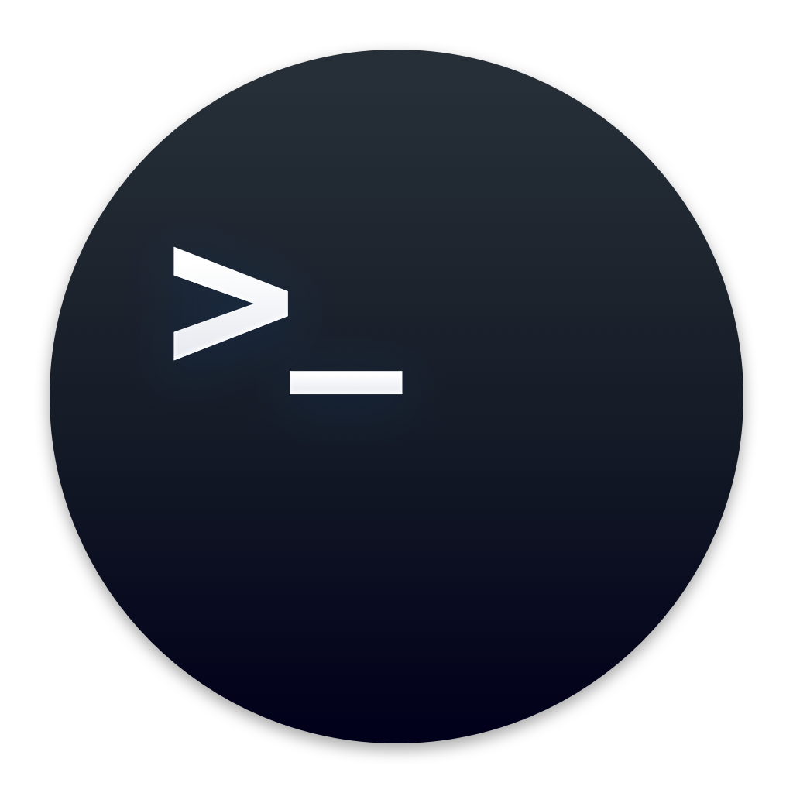

## Command Line Options

Currently, there are several command line options, and all are optional. Normally, one would simply run the program and you would enter in numbers, operands, and commands.

These options will either start RPNCalc in a certain "mode" such as `Debug` or `No Color` or will provide information and exist such as `Version` or `Help`.

## Options Table

| 
Option
 | Name            | Description                                                                                                                                                                                                                                                                                                                                                                                                                                                                                                                 |
|--------------------------------------|-----------------|-----------------------------------------------------------------------------------------------------------------------------------------------------------------------------------------------------------------------------------------------------------------------------------------------------------------------------------------------------------------------------------------------------------------------------------------------------------------------------------------------------------------------------|
| -D   --debug                      | Debug Mode      | Runs the program in debug mode.  This will display quite a bit of information in RED as you use the program.  This is mostly used by the developer and clutters everything up, but you may find it useful if you are trying to debug something.  I could certainly add a lot more if needed, but it's useful today.  You can also toggle debug mode on/off by entering in the command `debug` while within the program - you don't have to restart RPNCalc                                                                  |
| -l `name`   --load `name`         | Load Stack      | Load a saved stack.  This essentially will "name" your session and store the stack upon exit in the Java preferences system.  You can load the stack with the `-l name` command line option, or from within the program by using the `load name` command.  Please note the name field is whatever you want to call the instance but avoid spaces in the name.  I'm not aware of a limit to the number of saved stacks You can have.  If the name to load does not exist, the stack will be created and saved when you exit. |
| -z   --no-color                   | Disable Color   | Disable colorized output.  Useful if your current terminal doesn't support ANSI color sequences                                                                                                                                                                                                                                                                                                                                                                                                                             |
| -L   --license                    | Display License | Display the RPNCalc usage license.  Currently, RPNCalc uses the [The MIT License](https://opensource.org/licenses/MIT)                                                                                                                                                                                                                                                                                                                                                                                                      |
| -v   --version                    | Version         | This will display the current program version, but will also check GitHub for the leatest release. It is possible, especially if you are using RPNCalc as a Snap, to have a later version than the latest GitHub release.                                                                                                                                                                                                                                                                                                   |
| -h   -?   --help               | Help            | Display the program help page and exit.  This is the same as the `h` or `help` command within RPNCalc                                                                                                                                                                                                                                                                                                                                                                                                                       |