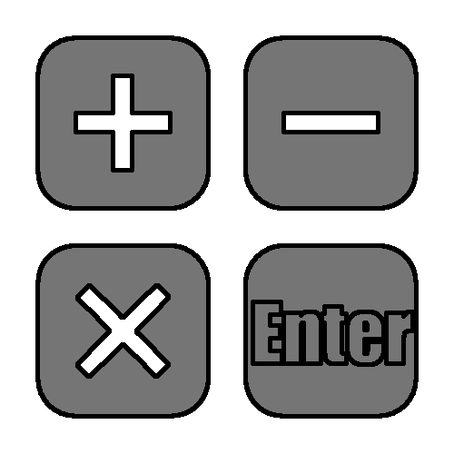

# Operands

Operands are the standard symbols used for basic mathematics on numbers.  The following is the list of operands supported by RPNCalc.  These are also supported by the NumOps shortcut described below.  

With the exception of the addition (`+`) and multiplication (`*`) operand the order of the items in the stack is important.  It's fairly intuitive when you look at it in the calculator, but refer to the following table if needed.

|Operand|Math|Description|
|:-------:|:----:|-------|
|+  |`Addition`| Add `line2` and `line`|
|-  |`Subtraction`| Subtract `line1` from `line2`|
|\* |`Multiplication`|Multiply`line1` and `line2`|
|/  |`Division`| Divide `line2` by `line1`|
|^  |`Exponent`| Take `line2` to the power of `line1`|

Below are two very simple examples that show the order is important

|Line Num|Stack|
|:------:|:---:|
|`line2`|3|
|`line1`|2|

Example: Minus `-`  will execute 3 - 2 and will yield `1`

|Line Num|Stack|
|:------:|:---:|
|`line2`|2|
|`line1`|3|

Example: Minus `-` will execute 2 - 3 and will yield `-1`

 

 

`Hint:` We'll discuss commands in later chapters, but the `swap` command `s` will swap the top two items in the stack (`line1` and `line2`).  Swap will also swap any two line numbers provided.  See the `Calculator Commands Chapter` for more information.

## The NumOps Shortcut

RPNCalc has an important shortcut that can speed up your calculations.  You can append one of the above operands at the end of an entered number and the program will, behind the scenes, place the number on top of the stack (`line1`) and then execute the operand.  For example:

`2 [ENTER]`

`3+ [ENTER]`
 
When the second enter is pressed,  the two stack items will be removed, added together, and the result, `5`, will be added back.  It's the same as entering this the following  three commands:

`2 [ENTER]`

`3 [ENTER]`

`+ [ENTER]`

As an example of this NumOps shortcut, see the following example:

`x = SQRT((((5+3) * 8)/2) ^ 6)`

Leveraging the shortcut, this would become:

- `5`
- `3+`
- `8*`
- `2/`
- `6^`
- `SQRT`

By the way, if you were wondering the answer is 32,768.

***Please note that you can not use this NumOps shortcut with a fractional number entry***