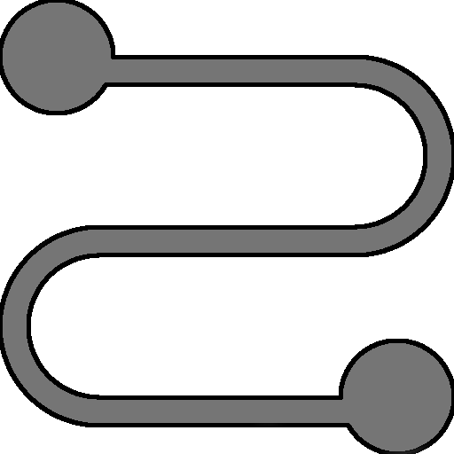

## User Defined Functions (UDFs)

RPNCalc can record your commands and save them as a user defined function. In essence, you are creating a new command that can be run.

When recording a new function, start by adding data to your stack that would emulate when you would run your function. The only data that will be part of your recording will
be data & commands entered ***after*** recording has been turned on. When you are ready, enter the `record on` command. A red `[Recording]` alert will appear in the status
line. Anything you add during this period will be recorded with the exception of the commands listed below. Enter your commands, numbers, etc. until you are done.

When recording is complete, enter `record off` to complete your recording. You'll be prompted for a function name. Your new command will be this name so choose a name without
spaces and that is easy to type when you wish to execute the function in the future. You should also not choose a name of an existing command as your function will not be able
to be called. If you do not provide a name, i.e, just hit enter, the recording will be discarded.

Then you can run your function whenever you like on the stack currently available. To run the function, simply type the name of your function as a standard command. To
see a list of the saved functions, execute `list func` and it will display the name and the steps you recorded.

User defined functions can be deleted with the `func del NAME` command or you can delete all of the functions with `func delall`

Functions are global and can work across any stack. They are saved in the preferences system and will be reloaded when RPNCalc starts. They are saved immediately after you
give a new recording a name and press enter.

When you execute a function, the steps of that function are executed one after the other. Therefore when you execute `undo` you will undo back through your function step
by step. You do not `undo` the entire function in one command. Of course, you can always run `undo NUM` where `NUM` is the steps to undo.

The following commands can be entered during a recording, but are not recorded.

- list
- debug
- ver, version
- help, h, ?
- rec, record
- func, function
- set, reset
- cx, x, quit, exit

## UDF Commands

| 
Command
 | Description                                                                                                                                                                                                                                          |
|----------------------------------------|------------------------------------------------------------------------------------------------------------------------------------------------------------------------------------------------------------------------------------------------------|
| record on rec on                    | Turn on recording.  Most commands and numbers entered after record is enabled will be saved.  There are some that are excluded from being recorded as detailed above                                                                                 |
| record off rec off                  | Turn off recording.  The user will be prompted to enter in a name for this function and that name will be used to run it in the future.  If you do not enter in a name the recording is canceled and  nothing will be saved                          |
| func del `NAME`                        | Delete a saved function.  The name must match the one given when saved.  A list of functions can be viewed with `list func`.  Undo will not recover a deleted function                                                                               |
| func delall                            | Delete all saved user defined functions. Please note that undo will not recover deleted functions                                                                                                                                                    |
| func export                            | Export all User Defined Functions to a file for backup or future import                                                                                                                                                                              |
| func import                            | Import a previously exported set of functions. Please note that importing will append the imported functions to the currently defined list.  If an imported function has the same name as an existing one, the existing function will be overwritten |

## Examples

### Example 1

Here is a full real world example. Lets say you'd like to make a user defined function to take the cube of number. Here are the steps you'd take to do that.

| Number |   Command    | Description                                                                                     |
|:------:|:------------:|:------------------------------------------------------------------------------------------------|
|   1    |     `c`      | Clear the stack.  Not really needed, but let's start off tidy                                   |
|   2    | `3 [Enter]`  | Add the number 3 to the stack.  This can be any number really as it's not part of the recording |
|   3    | `record on`  | Start recording.  From now on anything you do (mostly) will be recorded                         |
|   4    |     `3`      | Add 3 to the stack                                                                              |
|   5    |     `^`      | Take `line1` value to the power of 3                                                            |
|   6    | `record off` | Stop recording and give the function the name "cube"                                            |
|   7    | `list func`  | Show the user defined functions including the `cube` command you just made                      |

From now on, just type `cube` and `line1` will be cubed! Go You!  You can always list your defined functions with `list func`

### Example 2

Another real world but slightly more complex example. Say you wish to know the percentage different between two numbers. Let's create a function called `diffpercent` The
logic is to find the smallest number on the stack and then the largest. Divide them. Flip the sign and add one to it. Then convert it to a percent.

| Number |   Command    | Description                                                                   |
|:------:|:------------:|:------------------------------------------------------------------------------|
|   1    |     `c`      | Clear the stack.  Not really needed, but let's start off tidy                 |
|   2    |     `10`     | Setting up two numbers before we record the function                          |
|   3    |     `1`      | Setting up two numbers before we record the function                          |
|   4    | `record on`  | Start recording.  From now on anything you do (mostly) will be recorded       |
|   5    |    `min`     | Copy the smallest number in the stack to the top                              |
|   6    |    `max`     | Copy the largest number in the stack to the top                               |
|   7    |     `/`      | Divide them                                                                   |
|   8    |     `f`      | Flip the sign                                                                 |
|   9    |     `1`      | Add the number one to the stack                                               |
|   10   |     `+`      | Add the numbers together (effectively subtracting the division results from 1 |
|   11   |    `to%`     | Convert to a percent (multiply  by 100)                                       |
|   12   | `record off` | Save the function with the name `diffpercent`                                 |

In the example above, the result it 90%. There is a 90% different between 10 and 1. Going forward, you can use the command `diffpercent` anytime you need to find the
percentage different between the lowest and highest number on the stack.
